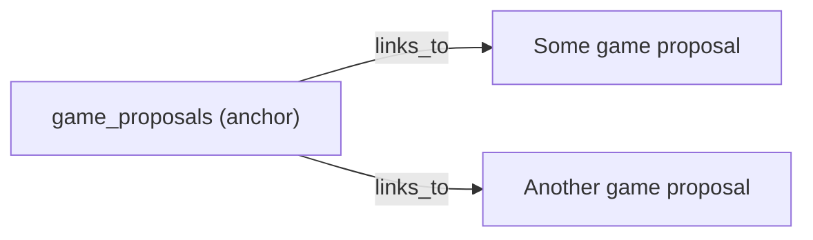

# First steps with Holochain Rust
## Build a simple lobby service for games

Before you can play a game on Holochain you first need to find someone to play with! 

This doc will guide you through implementing your first DNA. This DNA will allow agents to find other players by publicly advertising their interest in playing a game.

If at any time you need clarification of the concepts check out the [visual glossary](https://hackmd.io/2Xblt4U2T36Ur-IhtitETw?both)

## Getting started

**BEFORE YOU START FOLLOW THE [INSTALLATION GUIDE](https://developer.holochain.org/start.html) TO GET A WORKING HOLOCHAIN DEV ENVIRONMENT**

To make development easy we provide a nix-shell environment for Holochain. This includes all of the tools you need to develop on any platform. Once you have nix installed you can 

- **✍️Enter the Holochain dev nix-shell at any time by running**

```shell
$ nix-shell http://holochain.love
```

You should run all of the following commands from inside this nix-shell.

- **✍️To check everything is working run the following commands to start the shell and check the installed binaries**. 

```shell
[nix-shell:~]$ holochain --version
[nix-shell:~]$ hc --version
```

*Note: don't copy the `[nix-shell:~]$` part when running the commands. This is just indicating the shell prompt you should see.*

You should see version 0.0.20-alpha3 in both cases (ignore what the gif says).

<iframe src='https://gfycat.com/ifr/linearspitefulconure?autoplay=0' frameborder='0' scrolling='no' allowfullscreen width='640' height='480'></iframe>

If you are planning to code along at home you can start a new Holochain DNA project using the dev tool `hc`. 

- **✍️Run the following in the nix-shell to create an empty DNA and then add a zome called `main`:**
```
[nix-shell:~]$ hc init matchmaker
[nix-shell:~]$ cd matchmaker/zomes
[nix-shell:~]$ hc generate main rust-proc
[nix-shell:~]$ cd ..
```

This should result in the following directory structure

```
./matchmaker/
├── app.json
├── test
│   ├── index.js
│   └── package.json
└── zomes
    └── main
        ├── code
        │   ├── Cargo.toml
        │   └── src
        │       └── lib.rs
        └── zome.json
```

This default autogenerated DNA can be represented as follows:


## Looking around

For any zome written using the Rust HDK the main entry point is the `lib.rs` file. This is where the special WASM functions that expose the entry definitions and zome functions must live. Lets take a look. Open up the `lib.rs` file in your favourite editor.

Notice the `#[zome]` attribute on the top level module. The HDK converts this, and certain tagged functions inside it, to the correct form that the holochain core is expecting when compiled to WASM.

```rust
#[zome]
mod my_zome {
    ...
    // stuff in here can be used to define the entries and functions in our zome
}
```

Inside this there are functions tagged with different attributes such as `#[genesis]`, `#[entry_def]` and `#[zome_fn]` which fully define our zome. 

The default zome contains a single entry def and two exposed functions. The entry is defined by a special function tagged with the `#[entry_def]` attribute.

This is a lot to take in! All you need to know right now is that every holochain zome must have a module tagged with `#[zome]` in the 
`lib.rs` and this is where the entries and functions are defined.

## Entries

Recall that any piece of data that is stored in the holochain DHT or local chain is an entry. Entries associate a name (the `entry_type`) with some validation requirements. 

Lets begin to think about an entry which we will need to build a game lobby. One that comes to mind is a `GameProposal`. This is something an agent could publish to the public DHT indicating that they want to play a game with someone. The entry itself could have the following structure (expressed as a Rust struct):

```rust
struct GameProposal {
    agent: Address,
    message: String,
}
```

- **✍️Add this struct in place of the default `MyEntry` struct in the zome as shown.**

<iframe src='https://gfycat.com/ifr/annualhairyethiopianwolf?autoplay=0' frameborder='0' scrolling='no' allowfullscreen width='640' height='480'></iframe>

This example also introduces the HDK type `Address`, which is simply a string which is a hash/address that can be looked up in the DHT. The message is some string that should be displayed along with the proposal e.g. `"Looking for an expert level chess player to play on the 10/6/2019"`.

Entries themselves are defined using the `entry!` macro in the HDK. 

- **✍️Follow the steps below to define an entry that uses the above struct as follows:**

<iframe src='https://gfycat.com/ifr/pointeddisfiguredfishingcat?autoplay=0' frameborder='0' scrolling='no' allowfullscreen width='640' height='480'></iframe>


The piece of syntax above the function definition `#[entry_def]` is called an attribute in Rust. These can be used to give extra information to containing macros as to how the code should be handled. In this case we are telling the `zome` macro that this function defines an entry.

### Commiting an entry

If we want to create one of these entries from a user triggered zome function there are three steps. We first need to create the data as a rust struct, then create an `App::Entry` that uses the data, then call `hdk::commit()` to trigger the validation process and push the data to the peers in the network.

- **✍️Follow the steps in the gif to add a new zome function that creates and commits a proposal entry**

<iframe src='https://gfycat.com/ifr/adorablesentimentalcanadagoose?autoplay=0' frameborder='0' scrolling='no' allowfullscreen width='640' height='480'></iframe>

Again notice the `#[zome_fn("hc_public")]` attribute. This is a way of saying that this function should be exposed externally as a zome function in the public function group.

### Add some validation requirements
The integrity and scalability of Holochain applications depends on having smart and comprehensive validation. It is important to remember that validation callbacks will be run by every agent in the network that has to hold a given entry.

- **✍️Follow the steps in the fig to add a simple requirement to `game_proposal` entries - that they can only be created, not updated or deleted.**

<iframe src='https://gfycat.com/ifr/velvetyslowhummingbird?autoplay=0' frameborder='0' scrolling='no' allowfullscreen width='640' height='480'></iframe>

This basic validation can be updated to something more practical. Lets say that you can only post game proposals if you add yourself as the author field. In other words it is not permitted to post a proposal on another agents behalf.

The `validation_data` struct contains all kinds of useful information including the `sources` which is a list of all of the authors of an entry. This makes it quite simple to check if the author address is the same as the agent field.

- **✍️Follow the steps below to improve the validation to also check the author field**

<iframe src='https://gfycat.com/ifr/rawflashyindri?autoplay=0' frameborder='0' scrolling='no' allowfullscreen width='640' height='480'></iframe>

## Interacting with a DNA

Later on we will learn about the Holochain testing framework which uses Javascript for automated testing. For now we will use the popular tool cURL.

The `hc` tool has a simple way to start and run a DNA for testing. 
- **✍️From the root of the project (`matchmaker/`) run the following commands in the nix shell:**
```
[nix-shell:~]$ hc package
[nix-shell:~]$ hc run -i http
```
It may take a while to build the first time while it downloads all the required rust crates.

This will build the DNA package and then run it with a HTTP interface on port 8888. 

- **✍️Keep this running and in another shell run:**


```
curl --header "Content-Type: application/json" \
  --request POST \
  --data "{\"jsonrpc\": \"2.0\", \"method\": \"call\", \"params\": {\"instance_id\": \"test-instance\", \"zome\": \"main\", \"function\": \"create_proposal\", \"args\": {\"message\": \"test-message\"}}, \"id\": 0}" \
  http://localhost:8888
```

<iframe src='https://gfycat.com/ifr/majorfluffygyrfalcon?autoplay=0' frameborder='0' scrolling='no' allowfullscreen width='640' height='480'></iframe>

In response you should receive a Json object with an Ok field containing the hash of the proposal you just added to the holochain DHT. Great job!

If you don't want to use cURL you can use Postman or Insomnia to hit the HTTP endpoint instead. Just be sure to use HTTP post with content type JSON and using the following JSON-RPC object:
```json
{
  "jsonrpc": "2.0",
  "id": 0,
  "method": "call",
  "params": {
    "instance_id": "test-instance",
    "zome": "main",
    "function": "create_proposal",
    "args": {"message": "test!"}
  }
}
```

## Links

Lets picture for a moment that you have posted a game proposal to the DHT. You now sit back and wait for someone to join your game so you can finally test out Holochain for real. After several hours it dawns on you. How is anyone going to locate your proposal?! Without knowing the hash address of the entry you can't retrieve it. But without having the entry data you can't compute the hash.

It is problems like this that can be solved by using links. Links are a kind of system entry that contains a base address, a target address and some additional tag data. They are handled in a special way such that agents who hold the base will also hold a list of the addresses that are linked to the base. 

To make our game proposals easier to find lets link them to an entry that any agent will know how to find. In Holochain development we call these easy to find entries **anchors**. The implementation can be done in different ways but conceptually an anchor is an entry that will always be the same. It carries no information by itself. For example if we made an entry out of the string "game_proposals" then any agent could find the address (by hashing the string). If we then link our proposals to the anchor address then any agent can call `hdk::get_links` on the anchor to find all of the proposals. The anchor acts as a shared, known location where agents can check for new proposals.



### Defining Links

Lets add a new entry to our zome which defines an anchor. This is almost identical to the proposal entry but it uses the native `String` type rather than a struct.

- **✍️Follow along below to add a new entry definition for an anchor**

<iframe src='https://gfycat.com/ifr/quarterlysickbronco?autoplay=0' frameborder='0' scrolling='no' allowfullscreen width='640' height='480'></iframe>

The entry def is also where we can define links.

- **✍️Follow along below to define a link entry from an anchor to a game_proposal**

<iframe src='https://gfycat.com/ifr/rightcarelessdogfish?autoplay=0' frameborder='0' scrolling='no' allowfullscreen width='640' height='480'></iframe>

### Using Links

To achieve our goal of being able to retrieve the proposals we first need to update the `create_proposal` function to also commit an anchor entry and then link from the anchor to the new proposal.

- **✍️Add these extra lines to the `create_proposal` function so new proposals are linked to the anchor**

<iframe src='https://gfycat.com/ifr/weightybareafricanharrierhawk?autoplay=0' frameborder='0' scrolling='no' allowfullscreen width='640' height='480'></iframe>

Finally we can create a function which loads all the proposals that are linked to the anchor. This uses a handy function from the `hdk::utils` module `get_link_and_load_type`.

- **✍️Add a new function which calls `get_links` on the anchor to retrieve all the proposals**

<iframe src='https://gfycat.com/ifr/sorrowfuladvancedhydra?autoplay=0' frameborder='0' scrolling='no' allowfullscreen width='640' height='480'></iframe>

And thats it! The full zome is available at [on github](https://github.com/holochain-devcamp/game-matchmaking) for you to experiment with. Clone the repo to continue with the exercises below.

## Exercises

We have only implemented half a solution to the problem of finding a game partner. Once you have found a proposal that you like the look of and created a game. there needs to be a way for the original proposing agent to find it.

#### 1. Given a game struct
```rust
pub struct Game {
    pub player_1: Address,
    pub player_2: Address,
    pub created_at: u32,
}
```
write the entry definition, and link definitions required so that a game can be created and linked from a propsal.

#### 2. Write two new zome functions with signatures 

`accept_proposal(proposal_address: Address, created_at: u32) -> ZomeApiResult<()>` and 
`check_responses(proposal_address: Address) -> ZomeApiResult<Vec<Game>>`

that fulfil the required functionality of creating a game and linking it to the proposal and retrieving all linked games respectively. 

#### 3. Add delete functionality (stretch goal)

Currently proposals last forever. You should be able to delete them after you have found a match.

Check out the [Holochain documentation for the hdk::remove_entry function](https://developer.holochain.org/api/latest/hdk/api/fn.remove_entry.html) and implement a zome function `remove_proposal`. Ensure that the removal is reflected when subsequent calls are made to `get_proposals`. 
